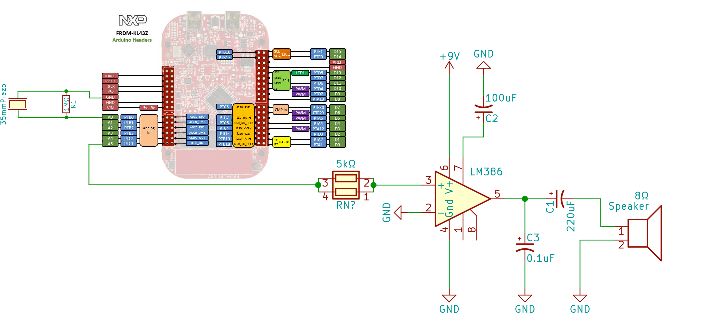

## Drumly
Synthesize drum beat upon trigger from piezo sensor.
## Parts Used
1. 8 Ohm 1W speaker
2. Audio amplifier [http://www.ti.com/lit/ds/symlink/lm386.pdf](LM386N-4)
3. [https://os.mbed.com/platforms/FRDM-KL43Z/](FRDM-KL43Z)
4. Electrolytic capacitors of values {0.1uF, 100uF, 220uF}
5. Resistors {5kohm, 1Mohm}
6. Piezoelectric sensor (35mm diameter)
7. Jumper canbles/wires
8. Breadboard (medium size would do) 
9. 9v DC voltage source

## Circuit Diagram

## TODO
* Attach additinal sensors for variety
* Synthesize drum beat for snare using few harmonics
* Periodically interrupt for ADC readings - PIT
## Acknowledgement
http://www.daycounter.com/Calculators/Sine-Generator-Calculator.phtml

